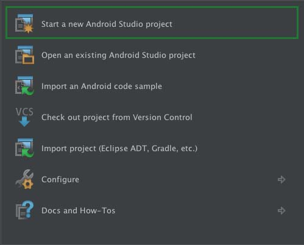
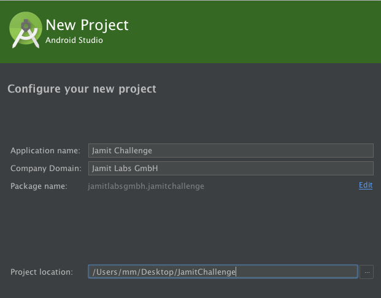
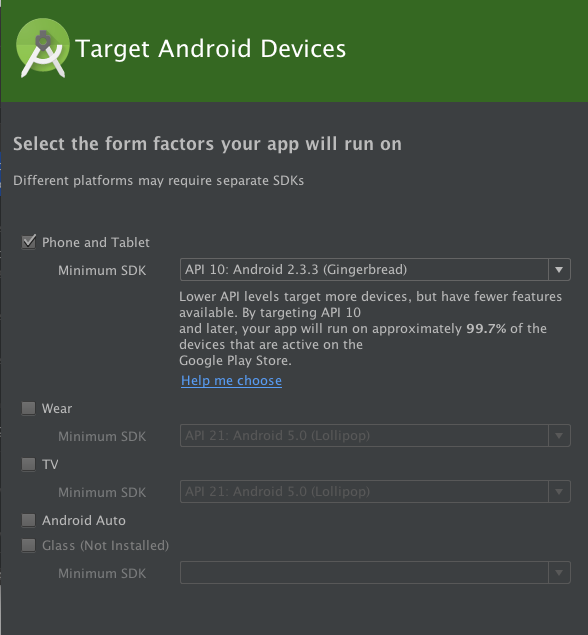
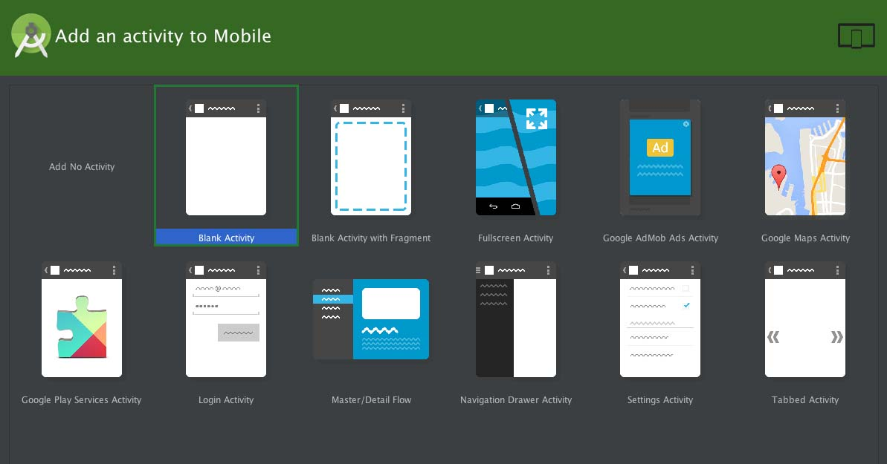
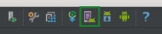
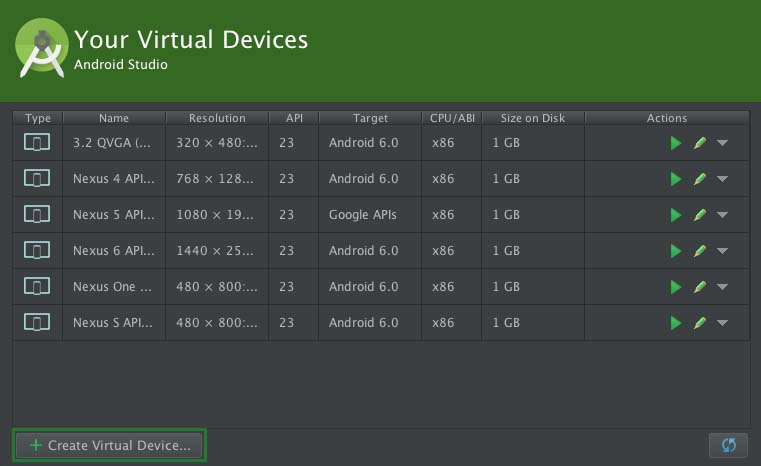
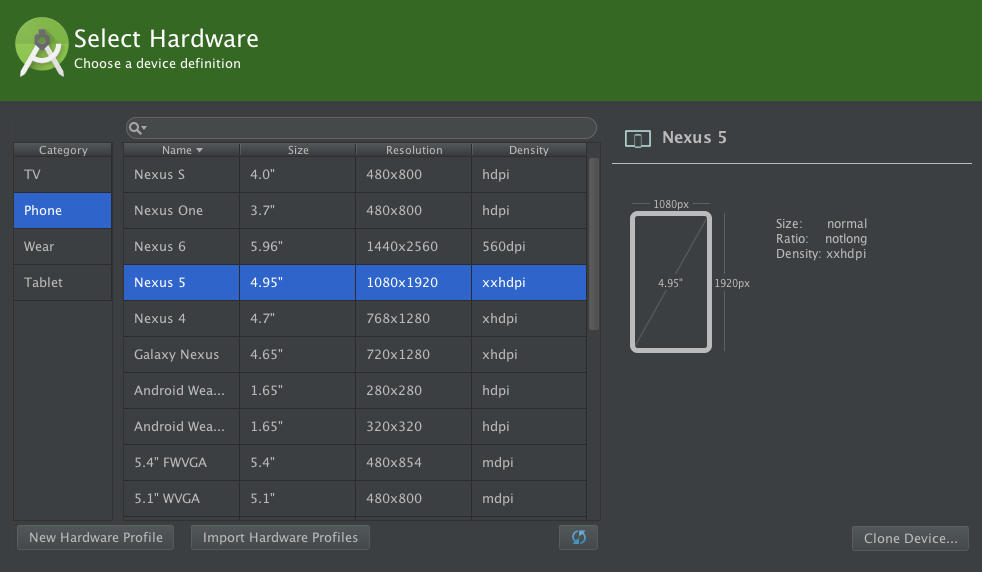
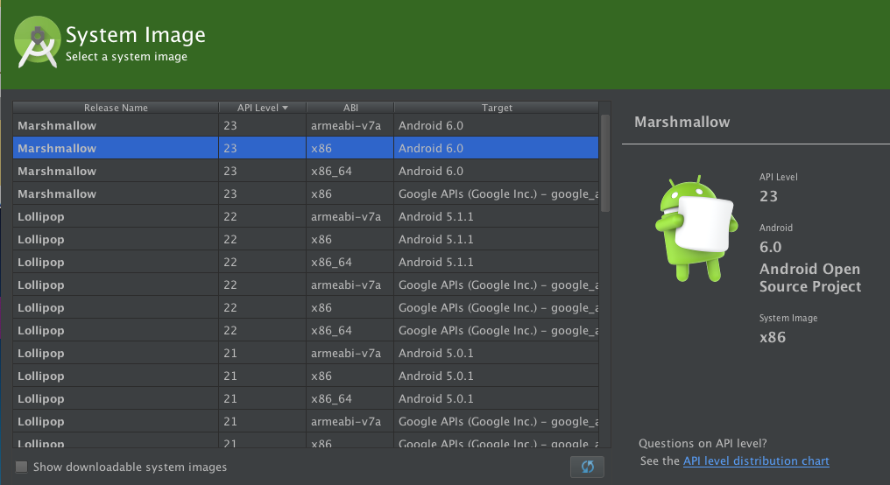
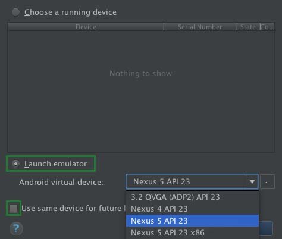

In diesem Artikel wird die Erstellung eines neuen Android Studio Projekts
behandelt. Dabei geht es darum welche Einstellungen zu Beginn vorgenommen werden
sollten und wie man Emulatoren zum Testen der App einrichtet.

## Erstellen eines neuen Projekts

Nachdem sich das erste Fenster geöffnet hat, muss man den Punkt "Start a new Android Studio project" auswählen, um ein komplett neues Projekt zu erstellen.

Im nächsten Schritt müssen die Rahmenbedingungen für das Projekt festgelegt werden.

* **Application name:** Hier muss der Name, den das Projekt / die Applikation haben soll, eingetragen werden.  
* **Company Domain:** Es gibt keine festen Vorgaben wie die Company Domain auszusehen hat.
Sinnvoll wäre zum Beispiel: jamitlabs.com, jamitlabs, de.jamitlabs, de.ka.jamitlabs.
Sie dient dazu die App eindeutig zu identifizieren, kann jedoch auch im nachhinein
noch in der gradle file geändert werden.
* **Package name:** Dieser wird aus dem Applikationsname und der Company Domain zusammen
gesetzt und dient als vollständiger Name für das Projekt. Man kann ihn jedoch auch
unabhängig von dem Applikationsname und Company Domain bearbeiten (Edit).
* **Project location:** Hier wird das Verzeichnis angeben, in welchem das Projekt angelegt werden soll.

Nun muss man auswählen für welche Geräte die App programmiert werden soll.
In den meisten Fällen wird dies **Phone and Tablet** sein. Das **Minimum SDK** gibt
die niedrigste Android Version an, auf welcher die App lauffähig sein wird.
Damit möglichst viele Geräte unterstützt werden, ist es sinnvoll eine der niedrigeren Versionen zu wählen.
Es gibt Funktionen, die erst auf neueren Versionen unterstützt werden.
Diese können dann für diese neueren Versionen frei gegeben werden.  

Auf diesem Screen kann man einstellen, welche Elemente beim Erstellen des
Projektes generiert werden sollen. Zu empfehlen ist die **Blank Activity**,
da hier schon die ersten notwendigen Ordner und die MainActivity angelegt werden.
Die MainActivity ist zuständig für das Starten des Systems, da es bei der App
Programmierung keine main() Methode gibt, die diese Aufgabe übernimmt.

Hier können der Activity Name, der Layout Name, der Titel und der Menu Ressourcen Name eingegeben werden. Die eingetragenen Werte können erst einmal übernommen werden und später auf das Projekt angepasst werden.

Jetzt sind alle Voreinstellungen vorgenommen und mit einem Klick auf **Finish** wird das Projekt erstellt.

## Einrichten der Emulatoren

Um die Anwendung zu testen, kann man entweder ein Smartphone im **Debuggable Mode**
anschließen oder sich **Emulatoren** einrichten, welche ein Smartphone simulieren und auf dem PC angezeigt werden.

Um die Emulatoren einzurichten, klicke in der Schaltfläche am oberen Rand des Fensters auf das hier gezeigte Icon.

*Übersicht über die Eingerichteten Emulatoren*

In dieser Ansicht werden die schon eingestellten Emulatoren angezeigt. Man kann
beliebig viele Geräte erstellen und diese später beim Starten der App auswählen.
Ist beim ersten Öffnen noch kein Emulator eingestellt oder möchte man einen Neuen
hinzufügen, muss man auf **+ Create Virtual Device...** klicken.

*Übersicht über zur Verfügung stehenden Emulatoren*

Hier kann man zuerst eine Kategorie auswählen, was für ein Gerätetyp man simulieren möchte.
In diesem Beispiel erstellen wir einen Smartphone Emulator (Phone). In der Tabelle werden nun
verschiedene Geräte mit näheren Informationen angezeigt (Displaygröße, Auflösung, Pixeldichte).
Um alle Screengrößen abzudecken und das Layout optimal zu gestalten, empfehlen wir die App
auf Emulatoren der Größe 3,2" bis 5,96" zu testen. Hat man sich für ein Gerät entschieden, dieses auswählen und auf Next klicken.

Auf diesem Screen ist eine Android System Version zu wählen. Auch hier ist es sinnvoll
unterschiedlichste Versionen zu testen. Vor allem bei niedrigen Versionen, die noch nicht alle
Funktionen unterstützen, ist es wichtig die lauffähigkeit zu überprüfen. Dabei sollte man jedoch
das Minimum SDK, für welche die App ausgelegt ist, im Hinterkopf behalten.

Auf dem letzten Screen kann man seine Angaben überprüfen und weitere Einstellungen treffen,
wie zum Beispiel die Größe des RAMs, heaps, Internen Speichers und der SD Karte.
Für die meisten Applikationen sollten aber die voreingestellten Werte genügen.
Mit einem Klick auf **Finish** wird der Emulator erstellt und der Liste hinzugefügt.

Um die Applikation nun in diesem Emulator zu testen, zunächst einmal das Fenster schließen.

Mit einem Klick auf den **grünen Pfeil** in der oberen Schaltfläche, startet man die App.

Beim ersten Starten ist noch kein **running device** angelegt. Um das zu tun **Launch emulator** auswählen.
In der Combo Box werden alle Emulatoren angezeigt, welche, wie oben beschrieben, eingerichtet wurden.
Hier nun das gewünschte Gerät auswählen. Möchte man dieses Gerät auch für die zukünftigen Launches
nutzen bei **Use same device for future launches** einen Haken setzen. Mit einem Klick auf **OK** wird der Emulator gestartet.
Dies kann unter Umständen eine Weile dauern. Wenn man eine Weile an einem Projekt arbeitet möchte,
ist es sinnvoll den Emulator nicht zu schließen, da es sonst bei jedem Start viel Zeit kosten würde.
Wurde er gestartet und nicht wieder geschlossen, wird er nun unter **running devices** angezeigt.

## Weitere Informationen

* [Erstellen eines neuen Projekts](http://developer.android.com/training/basics/firstapp/creating-project.html)
* [Android Emulator](http://developer.android.com/tools/devices/emulator.html)
* [AVD (Android Virtual Device) Manager](http://developer.android.com/tools/devices/managing-avds.html)
