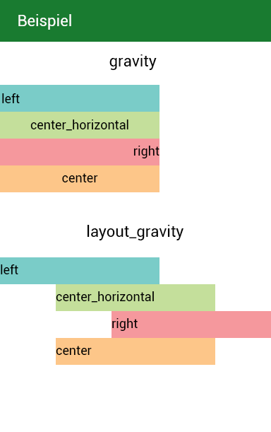
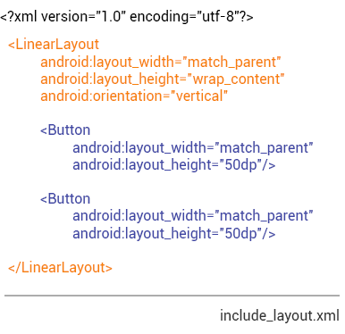
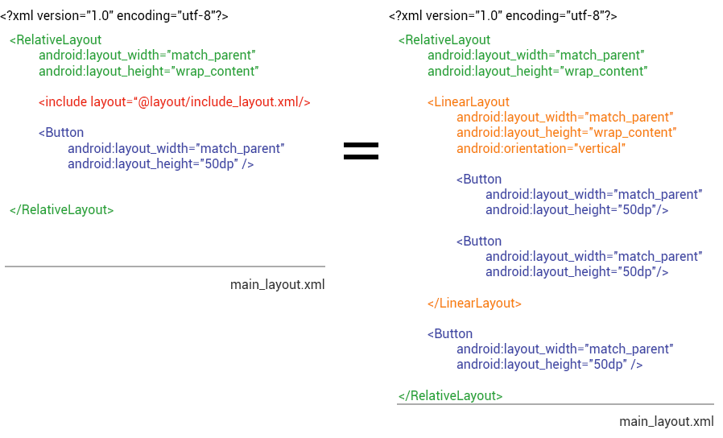
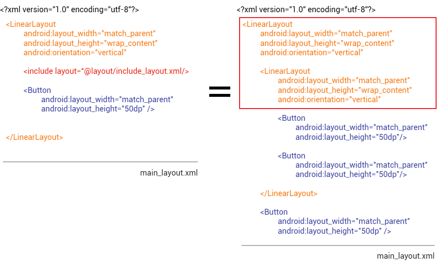
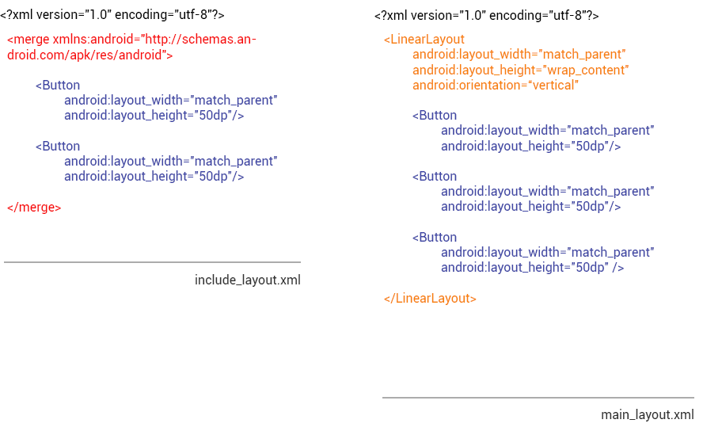

## Android Layout

### Unterschied layout_gravity und gravity

* **gravity** (*inside gravity*) beschreibt die Position des Inhalts innerhalb eines View Elements. Zum Beispiel die Anordnung eines Textes in einer View (left, right, center). Dieses Attribut kommt nicht zum Tragen wenn für layout_width oder layout_height *wrap_content* verwendet wurde, da so kein Raum entsteht in welchem das Element positioniert werden könnte.

* **layout_gravity** (*outside gravity*) beschreibt die Position eines 'child'-View in seiner 'parent'-View. Wie ist das Element relativ zu dem Element angeordnet in dem es definiert ist.

*Veranschaulichung von gravity und layout_gravity*

### Unterschied include und merge

`<include/>` - Tags werden dazu verwendet um einmal defnierte Layout Teile in andere Layouts einzufügen. Vorteile sind zum Einen, dass die XML Dateien übersichtlicher werden und zum Anderen, dass bei mehrfachem verwenden des gleichen Layouts (zum Beispiel einer Toolbar) Änderungen nur an einer Stelle gemacht werden müssen.

*Layout, das in ein anderes eingefügt werden soll.*

*Das Layout wird durch das `<include/>` - Tag eingefügt und enthält somit das neue Layout.*

Möchte man mehrere Elemente außerhalb des main_layouts definieren, müssen diese in ein Root-Element gepackt werden. In diesem Beispiel ist das in der include_layout.xml Datei das vertical LinearLayout. Möchte man diese Elemente in einer Datei in ein vertical LinearLayout einfügen kommt es zu Redundanzen. Das `<merge/>` - Tag hilft dabei redundante View Groups in der View - Hierachie zu entfernen.

*In diesem Beispiel ist das Root-Element in beiden Layouts ein **vertical LinearLayout**.*

Durch diese Schachtelung wird die Performance der UI verlangsamt. Um dies zu vermeiden kann man statt einer View Group als Root-Element, ein `<merge/>`- Element verwenden.

*In diesem Beispiel wurde anstatt einem vertical LinearLayout als Root-Element das `<merge/>`- Element verwendet. Das System ignoriert die `<merge/>`- Root und plaziert beide Elemente direkt im Layout. *

Weitere Informationen: [Re-using Layouts with include](http://developer.android.com/training/improving-layouts/reusing-layouts.html)
