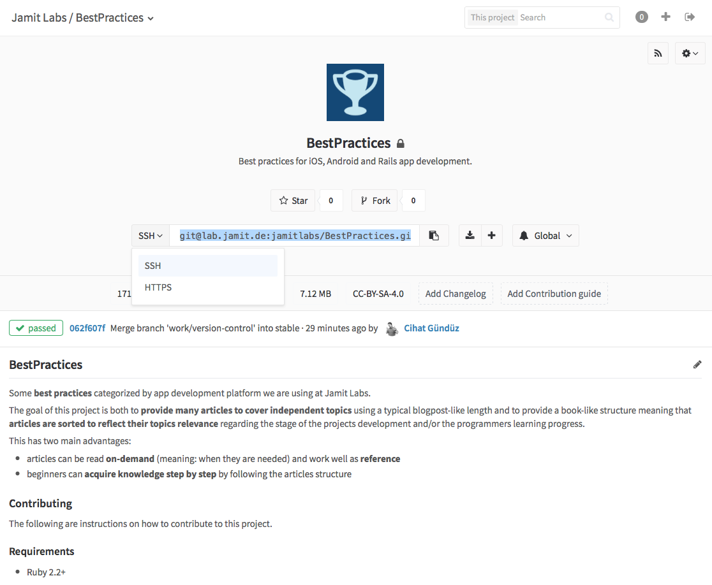
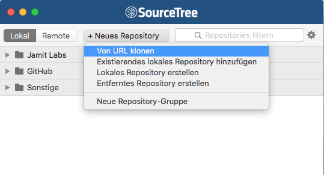
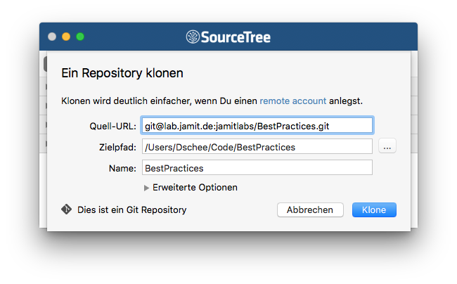
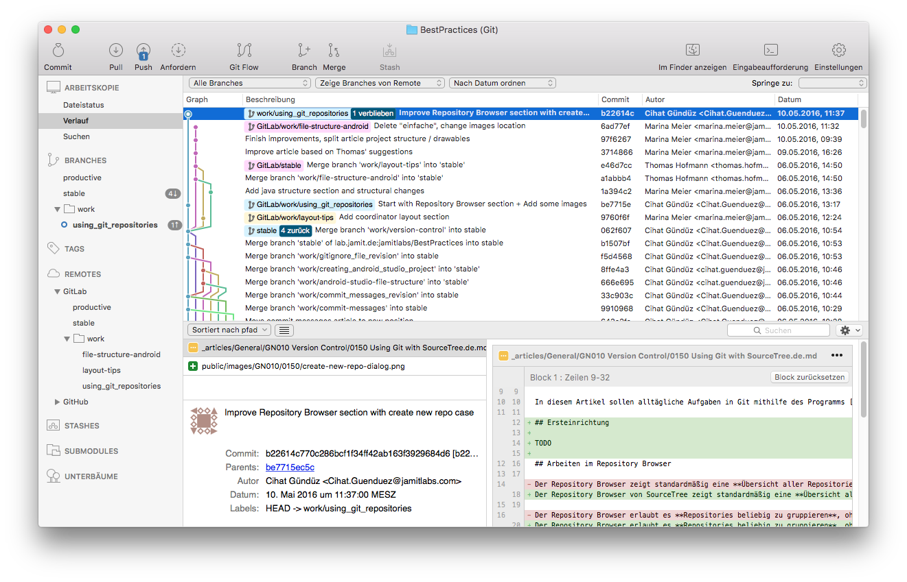
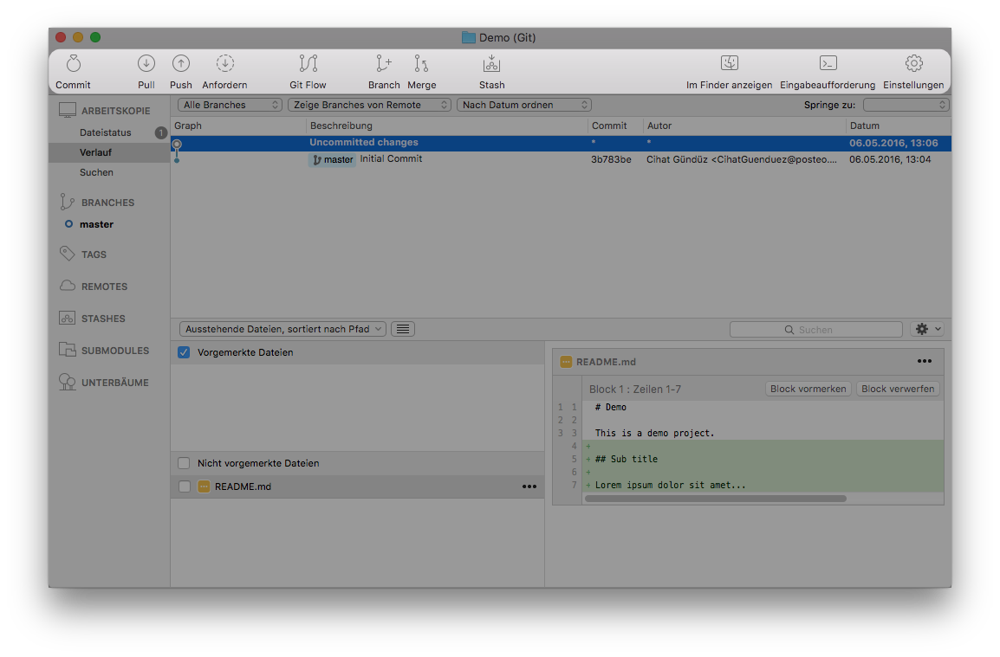
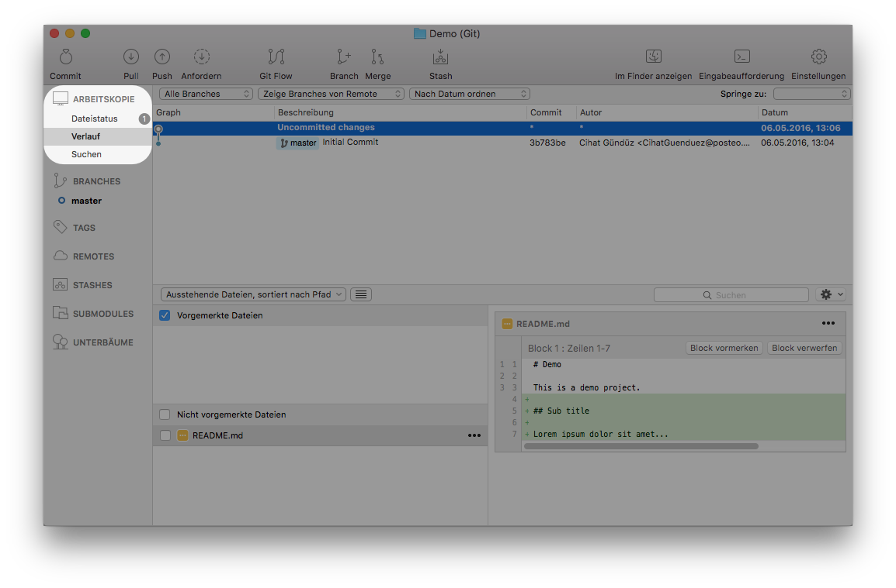
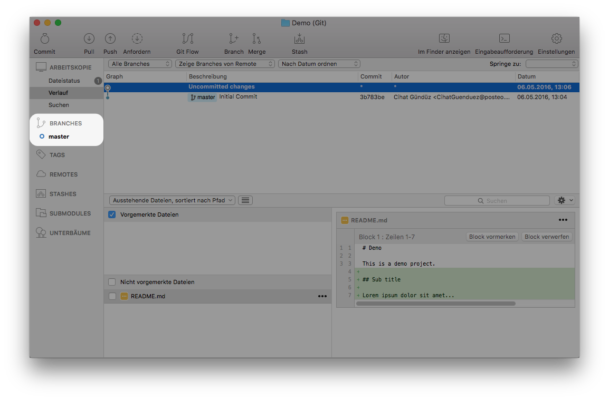
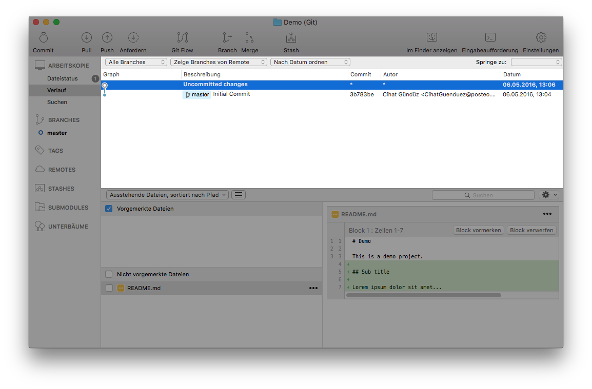
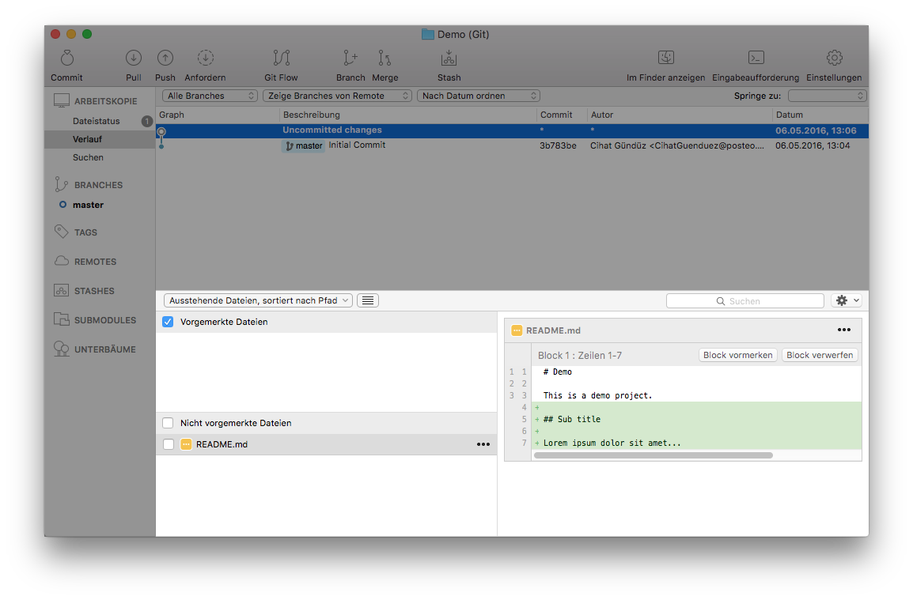
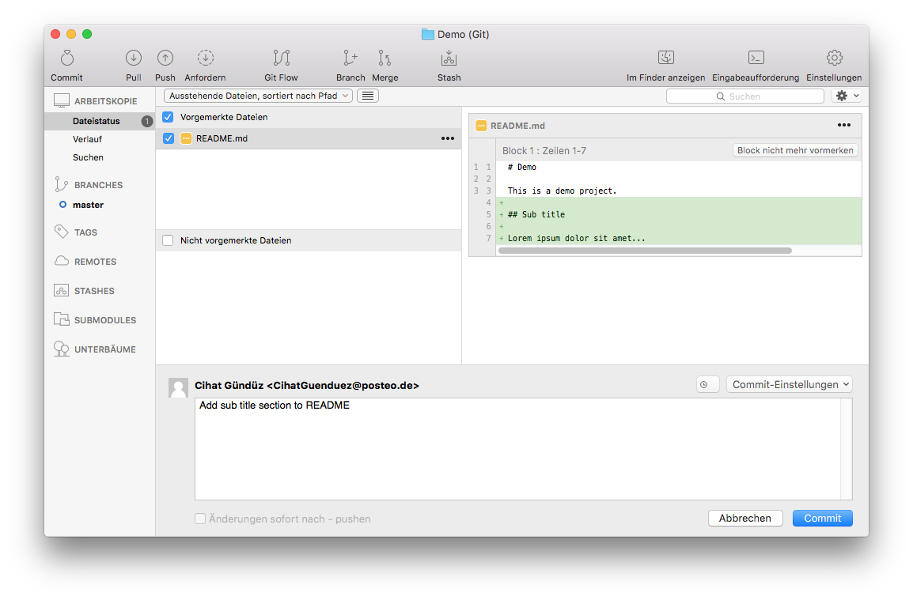

In diesem Artikel sollen alltägliche Aufgaben in Git mithilfe des Programms [SourceTree](https://www.sourcetreeapp.com) erklärt werden.

## Ersteinrichtung

Beim ersten Start von SourceTree wird man nach Vorname, Nachname und E-Mail-Adresse gefragt. Diese Informationen werden bei Commits berücksichtigt und sollten daher die Arbeits-Mailadresse wiedergeben und mit vollem Namen versehen werden. Außerdem ist innerhalb der ersten 30 Tage eine kostenlose Registrierung bei Atlassian notwendig, die jedoch kostenlos gemacht werden kann. Entsprechende Hinweise zeigt SourceTree automatisch an.

## Arbeiten im Repository Browser

Nach jedem Start von SourceTree erweitert einen üblicherweise der Repository Browser. Dieser zeigt eine **Übersicht aller Repositories**, die man **lokal** auf dem Rechner mithilfe von SourceTree eingerichtet hat. Erneut öffnen kann man ihn am schnellsten mit der Tastenkombination `Cmd+B`. Er besitzt auch eine **"Remote"-Ansicht**, in der alle Repositories von Hosted Services aufgelistet sind, auf die man Zugriff hat und in denen man sich über die Repository Browser-Einstellungen (Settings-Icon rechts oben) angemeldet hat. Beim nachfolgend beschriebenen Arbeitsstil braucht man die Remote-Ansicht jedoch nicht, weshalb sie komplett ignoriert werden kann.

Der Repository Browser erlaubt es **Repositories beliebig zu gruppieren**, ohne dass davon die tatsächlichen Pfade der Projekte geändert werden. Nützlich ist dies etwa, um mehrere Code-Projekte zu einem zusammengehörenden Produkt zusammen zu fassen.

### Erstellen eines neuen Repositories

Verzeichnisse, die von Git versioniert werden nennt man **Repositories**. Möchte man Git in einem neuen Projekt verwenden, so muss man aus dem Projektverzeichnis ein Repository machen. Das übernimmt meist schon die Entwicklungsumgebung (z.B. Xcode oder Android Studio) beim Anlegen eines Projektes. Nachfolgend sei kurz die manuelle Einrichtung durch SourceTree geschildert:

Klicke im Repository Browser auf den Button "+ Neues Repository" und wähle "Lokales Repository erstellen". Trage nun als Zielpfad das Verzeichnis ein, in welchem das Repository angelegt werden soll, vergebe einen Namen und klicke auf "Erstellen". Der Haken ist bei "Erstelle auch ein Remote Repository" standardmäßig nicht gesetzt und der Typ steht standardmäßig auf "Git", was beides so bleiben sollte. Damit ist das neue Repository angelegt.

*Im Dialog zum Erstellen eines neuen Repositorys trägt man Zielpfad und Name ein.*

### Ein bestehendes Repository verwenden

Soll man mit einem bestehenden Repository arbeiten, so erhält man in der Regel eine Einladung für den Zugriff auf das Projekt auf einem Hosted Service (z.B. github.com, gitlab.com). Diese Services bieten zwar die Möglichkeit an, den Code etwa als ZIP-Datei herunter zu laden, jedoch ist das nicht empfehlenswert. Stattdessen sollte man nach dem "SSH" bzw. "HTTPS" Pfad Ausschau halten.

*Möglichkeiten ein Repository von einem Hosted Service auszuschechen.*

Nun markiert und kopiert man entweder den SSH oder den HTTPS Pfad mittels `Cmd+C`, öffnet SourceTree, bringt den Repository Browser mit `Cmd+B` in den Vordergrund und wählt oben unter "+ Neues Repository" den Eintrag "Von URL klonen".

*Im Repository Browser können neue Repositories hinzugefügt werden.*

Es erscheint ein Dialog, in dem man den kopierten Pfad mittels `Cmd+V` einfügt, den Zielpfad auswählt, in den die Projektdateien des Projekts heruntergeladen werden sollen und definiert zusätzlich einen Anzeigenamen innerhalb des Repository Browsers.

*Beim Klonen kann der Zielpfad und der Anzeigename im Repository Browser festgelegt werden.*

Klickt man nun auf den Button "Klone" beginnt der Prozess, der den aktuellen Stand des Repositories vom Hosted Service herunterlädt – kurz das Repository wird **ausgecheckt***.

#### SSH oder HTTPS?

Grundsätzlich ist es einfacher per HTTPS auszuchecken, da Open Source Repositories dann gänzlich ohne Einrichtung funktionieren und für private Repositories lediglich die Login-Daten abgefragt werden. Daher sei für den Anfang HTTPS empfohlen.

Langfristig kann es jedoch auch Sinn machen auf SSH umzusteigen, da hier die Authentifizierung über ein Public-Key-Verfahren geschieht. Hierzu muss lokal auf dem Rechner eine Kombination aus Private- und Public-Keys generiert werden (falls nicht schon vorhanden), der Public-Key muss anschließend auf dem Hosted Service eingetragen werden, wodurch der Rechner für alle künftigen Projekte (durch den Private-Key) automatisch authentifiziert ist. Zur Einrichtung gibt es viele Anleitungen, zum Beispiel hier jeweils eine für [GitHub](https://help.github.com/articles/generating-an-ssh-key/) und eine für [GitLab](http://doc.gitlab.com/ce/ssh/README.html).

## Arbeiten in der Projektansicht

Mit einem Doppelklick auf ein Repository im Repository Browser öffnet man die Projektansicht eines einzelnen Repository. In der Projektansicht werden alle nötigen Aktionen innerhalb eines Git Repositories durchgeführt. Außerdem kann man in ihr die bestehenden Commits und Branches begutachten und somit die Änderungshistorie des Projekts verfolgen.

*Ein typisches Repository mit mehreren Branches, Merges, Remotes und Commits in der Projektansicht.*

Da die Projektansicht eine aus vielen Bestandteilen kombinierte Ansicht ist, kann sie im ersten Moment etwas erschlagend und überfüllt wirken. Daher seien nachfolgend die für die tägliche Arbeit wichtigen Teile kurz erklärt, wobei wir in den Beispielbildern ein neues Demo-Repository benutzen.

### Toolbar

*Wichtig sind in der konfigurierbaren Toolbar vor allem Pull und Push – die anderen Buttons werden viel seltener gebraucht und können deshalb auf Wunsch alle entfernt werden.*

Die Toolbar besteht standardmäßig aus 10 Buttons, von denen wir nur wenige im Alltag brauchen. Deshalb sei darauf hingewiesen, dass die Toolbar per Rechtsklick und "Symbolleiste anpassen ..." vollständig an die eigenen Bedürfnisse angepasst werden kann. Die so gemachten Änderungen bleiben projektübergreifend erhalten. Man kann beispielsweise die kaum genutzten Buttons "Commit", "Anfordern", "Branch", "Merge", "Stash" und "Im Finder anzeigen" aus der Toolbar entfernen. So bleiben nur noch die folgenden übrig:

- **Pull**: Lädt den aktuellsten Stand vom Hosted Service ("remote") des aktiven Branches und merged ihn automatisch in den lokalen Stand.
- **Push**: Lädt den aktuellsten Stand eines Branches zum Hosted Service hoch, damit andere ihn "pullen" können.
- **Eingabeaufforderung**: Öffnet das Terminal mit dem Pfad des Projektverzeichnisses um dort Command Line Tools zu verwenden.
- **Einstellungen**: Öffnet die projektspezifischen Einstellungen, wo man z.B. die Remotes verwalten kann.

### Sidebar-Eintrag Arbeitskopie

*In "Dateistatus" werden neue Commits gemacht, während "Verlauf" dazu dient die letzten Änderungen (Commits) zu durchstöbern. "Suchen" wird wesentlich seltener benutzt.*

Über den Eintrag "Arbeitskopie" in der Seitenleiste der Projektansicht lassen sich unterschiedliche Ziele erfüllen:

- **Dateistatus**: Hier werden die lokalen Änderungen im Repository angezeigt, wobei es möglich ist Dateien oder einzelne Zeilen als Änderungen für den nächsten Commit auszuwählen. Auch die Commit Message lässt sich hier definieren und der Commit schließlich auch durchführen.
- **Verlauf**: Hierbei handelt es sich um die Historie-Ansicht, die man standardmäßig präsentiert bekommt. Man kann hier die zuletzt gemachten Änderungen, die sogenannte "Git-Historie" sehen. Dies geschieht in Form von nach Datum absteigend sortierten Commits, wobei bei Anklicken eines Commits die zu dem Commit zugehörigen Änderungen im unteren Bereich angezeigt werden.
- **Suchen**: Hier kann man alle Commit Messages der gesamten Git-Historie gezielt durchsuchen. Die anderen beiden Ansichten werden wesentlich öfter gebraucht, da in ihnen die Hauptarbeit geleistet wird: "Dateistatus" zum Committen und "Verlauf" zum Durchstöbern der letzten Änderungen.

### Sidebar-Eintrag Branches

*TODO*

Hier werden alle Branches des Git Repositorys angezeigt, die lokal angelegt oder ausgecheckt wurden. Das Auschecken eines anderen Branches kann über den Eintrag "Remotes" per Doppelklick durchgeführt werden, sofern dort bereits eine Remote hinterlegt ist. Für Repositories, die man von einem Hosted Service heruntergeladen hat wird diese automatisch als Remote hinterlegt, andernfalls kann man manuell über den "Einstellungen" Button in der Toolbar eine neue Remote hinzufügen.

Der aktuelle Branch, deren Code-Stand man aktuell vorliegen hat (man sagt auch hierzu "ausgecheckt hat") ist fett gedruckt. Neue Branches erstellt man über den Button "Branch" in der Toolbar, jedoch raten wir davon ab, da wir in einem späteren Artikel zum Thema Git Flow ([GN010-0300](/articles/GN010-0300)) eine bessere Alternative erläutern werden.

### History

*Die Commit History des Projekts ist hier absteigend nach Datum sortiert (neueste oben) zu finden.*

Den größten Teil der Projektansicht nimmt die History-Ansicht ein. Hierbei handelt es sich um die Liste aller Commits im Projekt absteigend nach Commit-Datum sortiert und mit einigen Infos versehen:

- **Graph**: Hier lässt sich schnell erkennen, in welchem Branch der Commit getätigt wurde und wie die Branches zusammengeführt wurden bzw. aus welchen sie entstanden sind.
- **Beschreibung**: Hier wird die erste Zeile eines Commits angezeigt.
- **Commit**: Hierbei handelt es sich um einen eindeutigen Identifikator für einen Commit, den sogenannten SHA1-Hash.
- **Autor**: Der Autor / die Autorin des jeweiligen Commits wird hier mitsamt Mail-Adresse angezeigt.
- **Datum**: Hier steht der Zeitpunkt, zu dem der Commit gemacht wurde.

### Dateistatus

*Wählt man in der History einen Commit aus, so werden die betreffenden Änderungen angezeigt.*

Klickt man einen Commit in der History-Ansicht an, so werden die Details des Commits in der Dateistatus-Ansicht unten angezeigt. Hierbei sind links die Dateien zu sehen, in denen Änderungen stattfanden und rechts ist eine Zusammenfassung der Änderungen der jeweils links ausgewählten Datei. So kann man diese Ansicht dafür nutzen, sich die Änderungen anzusehen, die in einem einzelnen Commit durchgeführt wurden.

*Die Dateistatus-Ansicht zeigt die aktuellen Dateiänderungen im Projekt an und erlaubt sowohl das Vormerken von Dateien als auch das Eintragen einer Commit Message.*

In der Dateistatus-Ansicht sehen wir also wieder links die lokal geänderten Dateien und pro angeklickter Datei rechts die jeweiligen Änderungen. Hierbei ist die linke Seite in zwei Teile aufgeteilt:

- **Vorgemerkte Dateien**: Hier sind Dateiänderungen aufgelistet, die beim nächsten Commit berücksichtigt werden. Man nennt diesen Ort auch "gestagete" oder "indizierte" Änderungen. Das Entfernen eines Hakens sorgt dafür, dass eine Datei nicht mehr für den nächsten Commit vorgemerkt ist.
- **Nicht vorgemerkte Dateien**: Hier stehen alle lokalen Dateiänderungen, die noch nicht für den nächsten Commit vorgemerkt sind. Ein einfaches Anhaken übernimmt alle Änderungen an einer Datei in die obere Liste der vorgemerkten Änderungen.

Außerdem gibt es unten einen Bereich, in dem man eine Commit Message eintragen und diese mit Klick auf "Commit" auch committen kann. Wählt man "Änderungen sofort nach ... pushen" aus, so wird direkt nach dem Commit auch ein Push durchgeführt. Wir raten hiervon jedoch ab, da sonst keine Möglichkeit mehr besteht eventuell gemachte Tippfehler oder andere Versehen lokal noch rückgängig zu machen.
